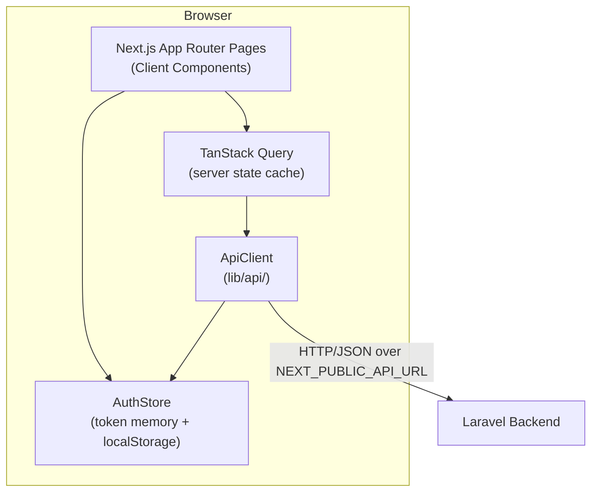
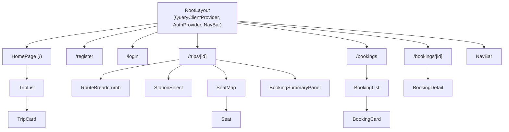
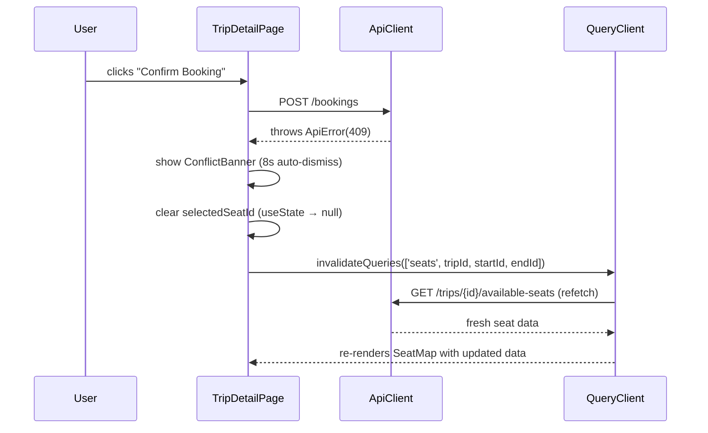

# Design Document — Fleet Bus Booking Frontend

## Overview

This document describes the technical design for the Fleet Management / Bus Booking System frontend: a Next.js 16 (App Router) + TypeScript single-page-style application. The app consumes a pre-existing Laravel/Sanctum backend over HTTP/JSON and covers registration, login, trip browsing, seat selection, booking, conflict handling, and booking management.

The application runs entirely on the client side of the App Router boundary. All pages are Client Components (via `'use client'`) or thin Server Component shells that hand off to Client Component subtrees immediately. This matches the SPA-style pattern described in the Next.js 16 docs: server components handle routing and initial HTML, while TanStack Query and React state manage all data fetching and UI.

**Key design goals:**
- A centralized, typed API client is the sole point of contact with the backend.
- TanStack Query owns all server state and handles cache invalidation (critical for the 409 conflict flow).
- A simple in-memory + `localStorage` AuthStore feeds the API client with the bearer token.
- The booking conflict (409) flow is a first-class concern and drives the data layer design.

---

## Architecture

### High-Level Overview



### Layer Responsibilities

| Layer | What it owns |
|---|---|
| **App Router Pages** (`app/`) | URL routing, page layout, composing feature components |
| **Feature Components** (`components/`) | Page-level and reusable UI, TanStack Query `useQuery`/`useMutation` calls |
| **TanStack Query** | Server state caching, background refetching, query invalidation |
| **ApiClient** (`lib/api/`) | All `fetch` calls, bearer token attachment, `ApiError` normalization |
| **AuthStore** (`lib/auth.ts`) | Token read/write to `localStorage` and memory, auth state for NavBar |
| **React `useState`** | Local ephemeral UI state (selected seat, selected stations, form fields) |

### Rendering Strategy

All pages use the **App Router with Client Components**. The root layout wraps the entire app in a `QueryClientProvider` and `AuthProvider`. Individual pages import their top-level feature component marked `'use client'`, which then calls `useQuery` / `useMutation` directly.

No Server Actions or server-side data fetching are used for this feature: the backend is a separate API server and all data is fetched from the client via the ApiClient.

### Route Structure

```
app/
├── layout.tsx              ← root layout: QueryClientProvider + AuthProvider + NavBar
├── page.tsx                ← trip list (/)
├── register/
│   └── page.tsx            ← registration form
├── login/
│   └── page.tsx            ← login form
├── trips/
│   └── [id]/
│       └── page.tsx        ← trip detail + seat booking
└── bookings/
    ├── page.tsx            ← my bookings list
    └── [id]/
        └── page.tsx        ← booking detail / confirmation
```

---

## Components and Interfaces

### Component Tree



### Shared UI Components

```typescript
// components/ui/LoadingSpinner.tsx
// Props: none (or optional size/label)
// Renders: <div role="status" aria-label="Loading">...</div>

// components/ui/ErrorBanner.tsx
// Props: { message: string; onRetry?: () => void }
// Renders: visible error banner; when onRetry provided, includes a retry button

// components/ui/EmptyState.tsx
// Props: { message: string; children?: ReactNode }
// Renders: centered empty state with optional child links/buttons

// components/ui/Toast.tsx
// Props: { message: string; type: 'success' | 'error'; timeoutMs?: number; onDismiss: () => void }
// Auto-dismisses after timeoutMs (default 5000ms); user can dismiss early
```

### NavBar

```typescript
// components/NavBar.tsx  — 'use client'
// Reads token from AuthStore to determine auth state
// Unauthenticated: links to /login, /register
// Authenticated: link to /bookings, logout button
// Logout: calls POST /logout then clears AuthStore (regardless of API success)
// While logout in flight: disables logout button
```

### Trip Components

```typescript
// components/trips/TripCard.tsx
// Props: { trip: Trip }
// Renders: route as ordered chain of station names with separators, trip date
// Click navigates to /trips/[id]

// components/trips/RouteBreadcrumb.tsx
// Props: { stops: TripStop[] }
// Renders: ordered station names separated by arrows (→)
// If fewer than 2 stops: renders available stop name(s) without arrows

// components/trips/StationSelect.tsx
// Props: { stops: TripStop[]; startStationId: number | null; endStationId: number | null;
//          onStartChange: (id: number) => void; onEndChange: (id: number) => void }
// Start select: all stops in sequence_order ascending
// End select: only stops with sequence_order > selected start stop's sequence_order
```

### Seat Components

```typescript
// components/seats/SeatMap.tsx
// Props: { seats: SeatData[]; selectedSeatId: number | null; onSelect: (id: number) => void }
// Renders: grid of Seat buttons
// aria-label="Seat selection"

// components/seats/Seat.tsx
// Props: { seat: SeatData; isSelected: boolean; onClick: () => void }
// Renders: <button>
//   aria-pressed="true/false" (selected state)
//   aria-disabled="true/false" (availability)
//   Visual distinction via Tailwind classes (color + cursor, not color alone)
//   Unavailable seats: non-interactive (click ignored), aria-disabled="true"
```

### Booking Components

```typescript
// components/booking/BookingSummaryPanel.tsx
// Props: { startStation: Station | null; endStation: Station | null;
//          selectedSeat: SeatData | null; isAuthenticated: boolean;
//          tripId: number; onConfirm: () => void; isSubmitting: boolean }
// If not authenticated: button reads "Log in to book", clicking redirects to /login?redirect=...
// If authenticated: "Confirm Booking" button, disabled until seat selected

// components/booking/BookingCard.tsx
// Props: { booking: Booking; onCancel: (id: number) => void; isCancelling: boolean }
// Renders: trip code, date, segment, seat number
// Cancel button shown only when trip date is in the future

// components/booking/ConflictBanner.tsx
// Props: { visible: boolean; onDismiss: () => void }
// Renders: non-technical message about seat being taken
// Auto-dismisses after 8 seconds; user can dismiss early
```

---

## Data Models

### API Type Definitions (`lib/api/types.ts`)

```typescript
export type Station = {
  id: number;
  name: string;
};

export type TripStop = {
  id: number;
  sequence_order: number;
  station: Station;
};

export type Bus = {
  id: number;
  name: string;
};

export type Trip = {
  id: number;
  code: string;
  date: string;          // ISO date string
  bus: Bus;
  stops: TripStop[];
};

export type SeatData = {
  seat_id: number;
  seat_number: number;
  is_available: boolean;
};

export type AvailableSeatsResponse = {
  trip_id: number;
  start_station_id: number;
  end_station_id: number;
  seats: SeatData[];
};

export type Booking = {
  id: number;
  trip: Trip;
  seat: { id: number; seat_number: number };
  start_stop: TripStop;
  end_stop: TripStop;
  created_at: string;    // ISO datetime string
};

export type User = {
  id: number;
  name: string;
  email: string;
  phone: string;
};

export type AuthResponse = {
  user: User;
  token: string;
};

export type ApiError = {
  status: number;        // 0 for network failures, HTTP status otherwise
  message: string;
  errors?: Record<string, string[]>;
};
```

### AuthStore (`lib/auth.ts`)

```typescript
// Module-level singleton (not React state) so ApiClient can read it synchronously
const AUTH_STORAGE_KEY = 'fleet_auth_token';

let _token: string | null = null;

// Called once at app init (in root layout effect or provider)
export function initAuthStore(): void {
  try {
    _token = localStorage.getItem(AUTH_STORAGE_KEY);
  } catch {
    _token = null;  // localStorage unavailable
  }
}

export function getToken(): string | null { return _token; }

export function setToken(token: string): void {
  _token = token;
  try { localStorage.setItem(AUTH_STORAGE_KEY, token); } catch { /* ignore */ }
}

export function clearToken(): void {
  _token = null;
  try { localStorage.removeItem(AUTH_STORAGE_KEY); } catch { /* ignore */ }
}
```

### TanStack Query Keys

```typescript
// lib/queryKeys.ts
export const queryKeys = {
  trips: () => ['trips'] as const,
  trip: (id: number) => ['trips', id] as const,
  availableSeats: (tripId: number, startId: number, endId: number) =>
    ['seats', tripId, startId, endId] as const,
  myBookings: () => ['bookings'] as const,
  booking: (id: number) => ['bookings', id] as const,
};
```

### ApiClient Layer (`lib/api/`)

```
lib/api/
├── types.ts        ← shared TypeScript types (above)
├── client.ts       ← apiFetch helper, ApiError class
├── auth.ts         ← register, login, logout, getMe
├── trips.ts        ← getTrips, getTrip, getAvailableSeats
└── bookings.ts     ← createBooking, getMyBookings, getBooking, cancelBooking
```

The `apiFetch` helper in `client.ts`:

```typescript
// lib/api/client.ts
export class ApiError extends Error {
  constructor(
    public status: number,
    public message: string,
    public errors?: Record<string, string[]>
  ) { super(message); }
}

async function apiFetch<T>(
  path: string,
  init?: RequestInit & { body?: unknown }
): Promise<T> {
  const baseUrl = process.env.NEXT_PUBLIC_API_URL;
  if (!baseUrl) throw new Error('NEXT_PUBLIC_API_URL is not defined');

  const token = getToken();
  const headers: Record<string, string> = {
    Accept: 'application/json',
  };
  if (token) headers['Authorization'] = `Bearer ${token}`;
  if (init?.body !== undefined) headers['Content-Type'] = 'application/json';

  let response: Response;
  try {
    response = await fetch(`${baseUrl}${path}`, {
      ...init,
      headers: { ...headers, ...init?.headers },
      body: init?.body !== undefined ? JSON.stringify(init.body) : undefined,
    });
  } catch {
    throw new ApiError(0, 'Network error. Please check your connection.');
  }

  if (!response.ok) {
    let message = response.statusText;
    let errors: Record<string, string[]> | undefined;
    try {
      const json = await response.json();
      message = json.message ?? message;
      errors = json.errors;
    } catch { /* body not parseable as JSON */ }

    if (response.status === 401) {
      clearToken();
      // Navigation to /login is triggered by caller or useEffect watching token
    }

    throw new ApiError(response.status, message, errors);
  }

  if (response.status === 204) return undefined as T;
  return response.json() as Promise<T>;
}
```

---

## Correctness Properties

*A property is a characteristic or behavior that should hold true across all valid executions of a system — essentially, a formal statement about what the system should do. Properties serve as the bridge between human-readable specifications and machine-verifiable correctness guarantees.*

### Property 1: Bearer token always attached when present

*For any* API request issued while the AuthStore holds a non-null token, the outgoing `fetch` call SHALL include an `Authorization: Bearer {token}` header where `{token}` is the exact string stored in the AuthStore.

**Validates: Requirements 1.2, 2.5**

---

### Property 2: Base URL prefix on all requests

*For any* API function call (register, login, getTrips, createBooking, etc.), the resulting `fetch` URL SHALL begin with the value of `NEXT_PUBLIC_API_URL`, with no extra slashes or mutations to the path.

**Validates: Requirements 1.3**

---

### Property 3: Non-2xx responses always produce a typed ApiError

*For any* HTTP response with a status code outside the range 200–299, the ApiClient SHALL throw an `ApiError` instance where `status` equals the HTTP status code, `message` is a non-empty string, and `errors` (when present in the response body) is a `Record<string, string[]>`.

**Validates: Requirements 1.4**

---

### Property 4: Content-Type set for all requests with a body

*For any* API call that sends a request body (register, login, createBooking, etc.), the `Content-Type: application/json` header SHALL be present in the outgoing request.

**Validates: Requirements 1.6**

---

### Property 5: Token storage round-trip

*For any* non-empty token string written via `setToken`, reading `getToken()` immediately after and reading `localStorage.getItem(AUTH_STORAGE_KEY)` SHALL both return that same token string.

**Validates: Requirements 2.1, 2.2**

---

### Property 6: Token cleared on logout

*For any* token that has been stored in the AuthStore, calling `clearToken()` SHALL result in `getToken()` returning `null` and `localStorage.getItem(AUTH_STORAGE_KEY)` returning `null`.

**Validates: Requirements 2.4**

---

### Property 7: End station options are a strict subset filtered by sequence order

*For any* trip and any selected start station, the options rendered in the end-station `<select>` SHALL contain only those stops whose `sequence_order` is strictly greater than the selected start station's `sequence_order`, and SHALL contain all such stops (no omissions within the valid range).

**Validates: Requirements 8.3**

---

### Property 8: Seat availability reflected in aria attributes

*For any* list of seats returned by the available-seats API, each seat rendered in the SeatMap SHALL have `aria-disabled="true"` if `is_available === false` and `aria-disabled="false"` if `is_available === true`, with no mismatches between the data model and the rendered DOM attribute.

**Validates: Requirements 8.7, 16.2, 16.4**

---

### Property 9: Protected route redirect includes original path

*For any* protected route path (e.g. `/bookings`, `/bookings/42`), when an unauthenticated user navigates to it, the resulting redirect URL SHALL be `/login?redirect={original-path}` where `{original-path}` is the exact path requested, and SHALL NOT be an absolute URL.

**Validates: Requirements 14.2**

---

## Error Handling

### ApiError Normalization

All errors from the backend are normalized into a single `ApiError` class with:
- `status: 0` — network failure before any HTTP response
- `status: 4xx/5xx` — HTTP error responses
- `message` — from `response.json().message` or `response.statusText`
- `errors` — from `response.json().errors` (validation errors map)

### Per-Status Handling

| Status | Handling |
|---|---|
| `0` (network) | Display generic network error banner with retry |
| `401` | Clear AuthStore token; redirect to `/login` (or `/login?redirect=...` from protected routes) |
| `404` | Display not-found message with link back to parent list |
| `409` (booking) | Show ConflictBanner, invalidate available-seats query, clear selected seat |
| `422` | Display field-level errors from `errors` map, or fallback message |
| `5xx` | Display generic error banner with retry |

### 409 Booking Conflict — Detailed Flow

This is the most complex error scenario and is handled as follows:



The `invalidateQueries` call is made within 3 seconds of receiving the 409 response (it is immediate — the query is invalidated synchronously in the catch block before the component re-renders). TanStack Query then refetches in the background while keeping the stale data displayed, then updates the SeatMap when fresh data arrives.

### 401 from Protected Pages

When any API call from a protected route returns 401:
1. `apiFetch` clears the AuthStore token.
2. The component's `useEffect` (watching token changes) or TanStack Query `onError` callback triggers `router.push('/login?redirect=' + pathname)`.
3. The user lands on the login page with their destination preserved.

### localStorage Unavailability

If `localStorage` throws (e.g. in private browsing modes that block it), all AuthStore operations silently degrade: `setToken` stores in memory only, `getToken` returns from memory, `clearToken` clears memory only. The user session works for the page lifetime but does not persist across refreshes.

---

## Testing Strategy

### Framework and Tooling

- **Test runner**: Vitest (per the Next.js 16 guide; `pnpm add -D vitest @vitejs/plugin-react jsdom @testing-library/react @testing-library/dom vite-tsconfig-paths`)
- **Component testing**: React Testing Library
- **Property-based testing**: `fast-check` (`pnpm add -D fast-check`)
- **API mocking**: `msw` (Mock Service Worker) or `vitest` `vi.fn()` for unit tests

### Unit Tests (Example-Based)

These cover specific scenarios and state transitions:

| Test | What it verifies |
|---|---|
| `ApiClient` — 401 response | Clears AuthStore token and throws ApiError with status 401 |
| `ApiClient` — missing base URL | Throws before dispatch |
| `ApiClient` — network failure | Throws ApiError with status 0 |
| `AuthStore` — no token in localStorage | `getToken()` returns null on init |
| `AuthStore` — localStorage unavailable | init and setToken do not throw |
| `NavBar` | Renders login/register links when unauthenticated |
| `NavBar` | Renders /bookings link and logout button when authenticated |
| Login page — 401/422 response | Displays single inline error, re-enables submit button |
| Login page — 5xx response | Displays error, does not clear email field |
| Login page — safe redirect | Ignores absolute URL in `redirect` query param, redirects to `/` |
| Register page — 422 response | Displays field-level errors from `errors` map |
| Register page — password mismatch | Shows client-side error before submitting |
| Trip list — empty state | Renders "No trips available" message |
| Trip list — error state | Renders ErrorBanner with retry button |
| Trip list — loading state | Renders LoadingSpinner with role="status" |
| SeatMap — seat click toggles selection | Clicking available seat selects; clicking again deselects |
| SeatMap — unavailable seat click | Ignored; seat remains unselected |
| Booking confirm — unauthenticated | Button reads "Log in to book"; redirects to /login?redirect=... |
| Booking confirm — 409 flow | ConflictBanner appears; seat selection cleared; query invalidated |
| Booking confirm — 422 flow | Inline error displayed near station selectors; no navigation |
| Booking confirm — general error | Error message displayed; selected seat and segment unchanged |
| Booking confirm — 201 success | Navigates to /bookings/{id} |
| ConflictBanner | Auto-dismisses after 8 seconds |
| ConflictBanner | User can dismiss before 8 seconds |
| Booking detail — 404 | Renders not-found message and link back to /bookings |
| Booking list — empty state | Renders "You haven't booked any trips yet" with link to / |
| Booking list — cancel fails | Error message shown, booking remains in list |
| Toast — auto-dismiss | Dismisses after configurable timeout (default 5s) |
| Toast — manual dismiss | User can dismiss before timeout |
| Booking detail — direct navigation | Does NOT show success Toast |

### Property-Based Tests

Using `fast-check`, minimum 100 iterations per property. Each test references its design property below.

**Property 1: Bearer token always attached when present**
```
// Feature: fleet-bus-booking-frontend, Property 1: Bearer token always attached when present
fc.assert(fc.asyncProperty(fc.string({ minLength: 1 }), async (token) => {
  setToken(token);
  let capturedHeaders: Headers;
  vi.spyOn(global, 'fetch').mockImplementation(async (_, init) => {
    capturedHeaders = new Headers(init?.headers);
    return new Response('{}', { status: 200 });
  });
  await apiFetch('/trips');
  expect(capturedHeaders.get('Authorization')).toBe(`Bearer ${token}`);
}), { numRuns: 100 });
```

**Property 2: Base URL prefix on all requests**
```
// Feature: fleet-bus-booking-frontend, Property 2: Base URL prefix on all requests
// For any path string, the resulting fetch URL must start with NEXT_PUBLIC_API_URL
```

**Property 3: Non-2xx responses always produce a typed ApiError**
```
// Feature: fleet-bus-booking-frontend, Property 3: Non-2xx responses always produce a typed ApiError
// For any status code in [400..599], thrown error must be ApiError with matching status
```

**Property 4: Content-Type set for all requests with a body**
```
// Feature: fleet-bus-booking-frontend, Property 4: Content-Type set for all requests with a body
```

**Property 5: Token storage round-trip**
```
// Feature: fleet-bus-booking-frontend, Property 5: Token storage round-trip
fc.assert(fc.property(fc.string({ minLength: 1 }), (token) => {
  setToken(token);
  expect(getToken()).toBe(token);
  expect(localStorage.getItem(AUTH_STORAGE_KEY)).toBe(token);
}), { numRuns: 100 });
```

**Property 6: Token cleared on logout**
```
// Feature: fleet-bus-booking-frontend, Property 6: Token cleared on logout
fc.assert(fc.property(fc.string({ minLength: 1 }), (token) => {
  setToken(token);
  clearToken();
  expect(getToken()).toBeNull();
  expect(localStorage.getItem(AUTH_STORAGE_KEY)).toBeNull();
}), { numRuns: 100 });
```

**Property 7: End station options filtered by sequence order**
```
// Feature: fleet-bus-booking-frontend, Property 7: End station options are a strict subset filtered by sequence order
// Generate random TripStop arrays with distinct sequence_orders, pick a random start stop,
// render StationSelect, assert that end options only have sequence_order > start's sequence_order
```

**Property 8: Seat availability reflected in aria attributes**
```
// Feature: fleet-bus-booking-frontend, Property 8: Seat availability reflected in aria attributes
fc.assert(fc.property(fc.array(fc.record({
  seat_id: fc.integer(),
  seat_number: fc.integer(),
  is_available: fc.boolean(),
}), { minLength: 1 }), (seats) => {
  const { getAllByRole } = render(<SeatMap seats={seats} selectedSeatId={null} onSelect={() => {}} />);
  const buttons = getAllByRole('button');
  seats.forEach((seat, i) => {
    expect(buttons[i].getAttribute('aria-disabled'))
      .toBe(seat.is_available ? 'false' : 'true');
  });
}), { numRuns: 100 });
```

**Property 9: Protected route redirect includes original path**
```
// Feature: fleet-bus-booking-frontend, Property 9: Protected route redirect includes original path
// Generate random paths under /bookings, simulate unauthenticated access,
// assert redirect is to /login?redirect={original-path} and is not absolute
```

### Test File Structure

```
__tests__/
├── lib/
│   ├── api/
│   │   ├── client.test.ts         ← ApiError, apiFetch (unit + property tests 1-4)
│   │   └── auth.test.ts           ← register, login, logout
│   └── auth.test.ts               ← AuthStore (unit + property tests 5-6)
├── components/
│   ├── NavBar.test.tsx
│   ├── seats/
│   │   ├── Seat.test.tsx
│   │   └── SeatMap.test.tsx       ← property test 8
│   ├── trips/
│   │   ├── StationSelect.test.tsx ← property test 7
│   │   └── TripCard.test.tsx
│   ├── booking/
│   │   ├── BookingSummaryPanel.test.tsx
│   │   └── ConflictBanner.test.tsx
│   └── ui/
│       ├── ErrorBanner.test.tsx
│       ├── Toast.test.tsx
│       └── LoadingSpinner.test.tsx
└── pages/
    ├── login.test.tsx
    ├── register.test.tsx
    ├── trips/[id].test.tsx        ← 409 flow, 422 flow, success flow
    ├── bookings.test.tsx
    └── bookings/[id].test.tsx     ← property test 9 (redirect)
```

### Coverage Targets from Requirements 17

The following flows map directly to Requirement 17 acceptance criteria:

| Req. 17.x | Test |
|---|---|
| 17.1 | `SeatMap.test.tsx` — aria-disabled reflects is_available (property test 8) |
| 17.2 | `trips/[id].test.tsx` — select segment → select seat → confirm → URL contains booking ID |
| 17.3 | Multiple page tests — LoadingSpinner with role="status" during fetches |
| 17.4 | `ErrorBanner.test.tsx` — retry button with accessible label |
| 17.5 | `trips/[id].test.tsx` — mock POST /bookings → 409, assert conflict banner, refreshed seat map, cleared selection |
| 17.6 | `login.test.tsx`, `register.test.tsx` — mocked 422, error per invalid field |

### Accessibility Testing Note

Automated tests verify structural accessibility (aria attributes, label associations, tab order in unit tests). Full WCAG compliance requires manual testing with assistive technologies such as NVDA + Firefox or VoiceOver + Safari.
